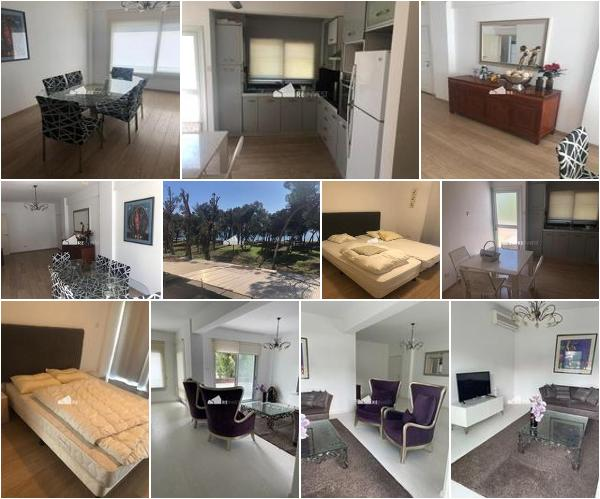

# com.dabogee.simple-image-collage

### Description
Generates a random collage from given images.

### Examples
<div style="clear: both;">




</div>


### Setup repository

```xml

<repositories>
    ...
    <repository>
        <snapshots>
            <enabled>true</enabled>
        </snapshots>
        <id>github-packages</id>
        <url>https://maven.pkg.github.com/dabogee/com.dabogee.simple-image-collage</url>
    </repository>
</repositories>
```

### Add dependency

Check latest version here
https://github.com/dabogee/com.dabogee.simple-image-collage/packages/

```xml
<dependency>
    <groupId>com.dabogee.tools</groupId>
    <artifactId>simple-image-collage</artifactId>
    <version>1.0-SNAPSHOT</version>
</dependency>
```