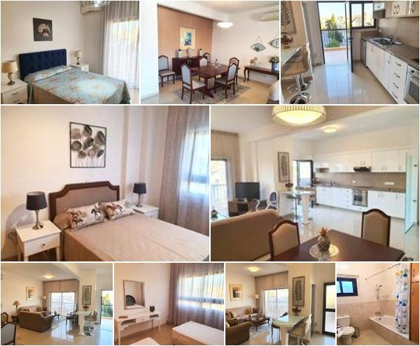

# com.dabogee.simple-image-collage

Note:

Sorry, I didn't have enough time to publish it to the maven central repository but if you can help me with this task, please, make a PR about it.

### Description

Generates a random collage from a set of given images.


### Examples
<div style="clear: both; margin: 20px 0;">


</div>
<p>&nbsp;</p>

<div style="clear: both; margin: 20px 0;">


</div>
<p>&nbsp;</p>

<div style="clear: both; margin: 20px 0;">

</div>
<p>&nbsp;</p>

### Usage
```java
// Constructors
ImageCollageGenerator.files(List<File>, ImageCollageProperties)
ImageCollageGenerator.is(List<InputStream>, ImageCollageProperties)
ImageCollageGenerator.images(List<BufferedImage>, ImageCollageProperties)
  
// Example
ByteArrayOutputStream os = new ByteArrayOutputStream();
ImageIO.write(ImageCollageGenerator.is(streams, props).concat(), "jpeg", os);
```
```java
// Properties
/**
 * Total width of a result image.
 */
private Integer maxWidth = 600;

/**
 * width / height.
 * Avoiding horizontal grey borders (Telegram).
 */
private Double maxRatio = 5.0;

/**
 * width / height.
 * Avoiding vertical grey borders (Telegram).
 */
private Double minRatio = 1.15;

/**
 * Number of attempts to generate a collage
 * which fits into ratio range.
 */
private Integer generateAttempts = 100;

/**
 * Border props.
 */
private Integer borderWidth = 1;
private Color borderColor = Color.WHITE;

/**
 * Does not look good with this effect on small sizes.
 * Because hard clip looks ugly on jpeg.
 */
private Integer cornerRadius = 0;

private Integer minImagesPerRow = 1;
private Integer maxImagesPerRow = 4;

private Integer maxRows = 5;

```
### MaxRatio and minRatio parameters
**MaxRatio** and **minRatio** are used to avoid too tight and too tall images like mentioned below where extra space is marked in red. If you don't have any limitations in image/collage height-width ratio then you can play with those settings.

<div style="clear: both; margin: 20px 0;">

<p>&nbsp;</p>

</div>
<p>&nbsp;</p>

### Setup repository

```xml

<repositories>
    ...
    <repository>
        <snapshots>
            <enabled>true</enabled>
        </snapshots>
        <id>github-packages</id>
        <url>https://maven.pkg.github.com/dabogee/com.dabogee.simple-image-collage</url>
    </repository>
</repositories>
```

### Add dependency

Check latest version here
https://github.com/dabogee/com.dabogee.simple-image-collage/packages/

```xml
<dependency>
    <groupId>com.dabogee.tools</groupId>
    <artifactId>simple-image-collage</artifactId>
    <version>1.0-SNAPSHOT</version>
</dependency>
```